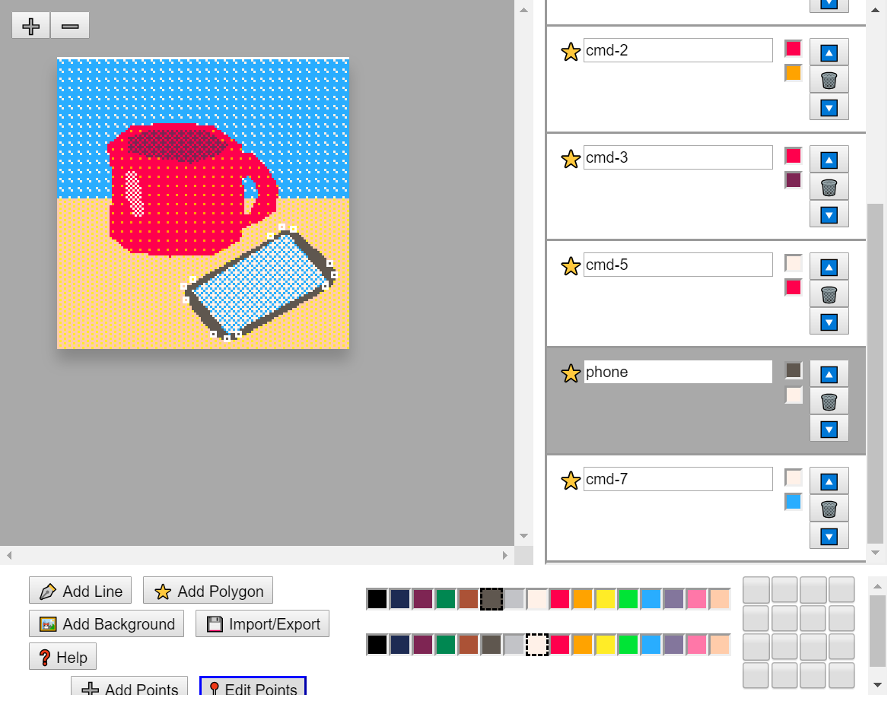
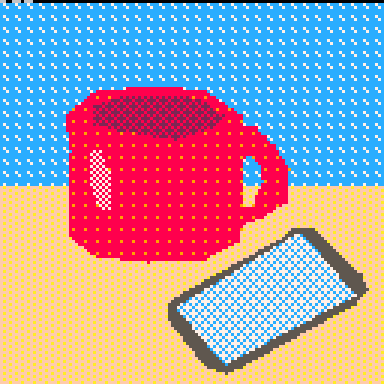

# GMagic 🧙





## Purpose

GMagic is a simple polygon and line editor, developed to prepare 128x128, 16 color graphics for use on the PICO-8. By using only lines and polygons to compose images, the compressed image data can be shared with PICO-8 renderers and use very little cart space for complex animations. It's basically an extremely simple vector graphics editor.

GMagic is loosely inspired by the Graphics Magician Picture Painter, software used in the late 70s and early 80s to design graphics for adventure games and other programs of the time.

## Starting the app

Download the repo, then open a terminal in the folder. Run:

```bash
  yarn

  yarn start
```

This should start the editor at localhost:3000.

## Drawing

The main concept that drives this editor is that drawings will be composed solely of layered polygons and polylines (chains of lines). These two sorts of drawing methods are referred to as **commands** from here on, because they can be thought of as tasks for the software to accomplish drawing.

The workspace is broken out into 3 main sections: the **Canvas** in the upper left of the page, the **Commands List** in the upper right, and the **Tools Palette** along the bottom.

### The Canvas

The Canvas is where you can view and edit your drawing. There are zoom in/out buttons for adjusting your view, and you will spend most of your time adjusting points in this section.

### The Commands List

The Commands List describes the stacking order of all of the polygons and lines in your drawing. Each command has a text box for the name of the command, a glyph indicating the type of command (⭐for polygons, ✒️ for lines), two color swatches to show what colors are applied to the command, and some buttons for layer adjustment. By clicking the up or down arrows, you can adjust how your commands are stacked in the drawing, with commands at the top of the list farthest to the "back" of the drawing. Finally, the 🗑️ button deletes the command.

Clicking on a command in the Commands List turns it gray, and clicking it again turns it back white. When a command in the Commands List is gray, it is considered the *active command*. That means that you can use the tools in the Tools Palette to manipulate its properties.

### The Tools Palette

In the Tools Palette are three main sections: a set of buttons, two color palettes, and a checkbox grid.

The **Add Line** button lets you start drawing a line by clicking on the Canvas. When you're done drawing the line, simply click the line's command in the Commands List to stop it from being the active command. Similarly, **Add Polygon** lets you start drawing a new filled-in shape.

**Add Background** is just a special-case version of Add Polygon - it's a preset that draws a polygon box to cover the Canvas, and the new command places itself in back of all of your other commands.

While a command is active, two new buttons will appear in this menu: **Add Points** and **Edit Points**. Add Points is crude, in that when it is selected (it will have a blue border) and you click on the Canvas, a new point will be added after the last point you added to the command. You might need to switch to Edit Points and move things around to your liking. Edit Points lets you drag existing points to new locations on the Canvas.

**Import/Export** calls up a modal that lets you import a drawing previously exported as JSON, and also save your drawing as either JSON or proprietary PICO-8 markup. PICO-8 doesn't have polygon and polyline commmands, so I've written some myself. This section will be updated when the code is ready to share.

The **Color Palettes** let you control the primary and secondary colors for the active command. They work in tandem with the grid of checkboxes, called the **Pattern Toggle**. With a polygon command selected, try clicking a color in each color palette, then checking and unchecking the boxes in the Pattern Toggle. You should see that the pattern made by the checkboxes determines how the colors you selected fill the polygon. There are lots of interesting combinations possible using this method - try experimenting with different patterns!

## Known bugs

There is a bug in the polygon fill code that prevents fills occurring at Y=0. This is my top priority for the near future.